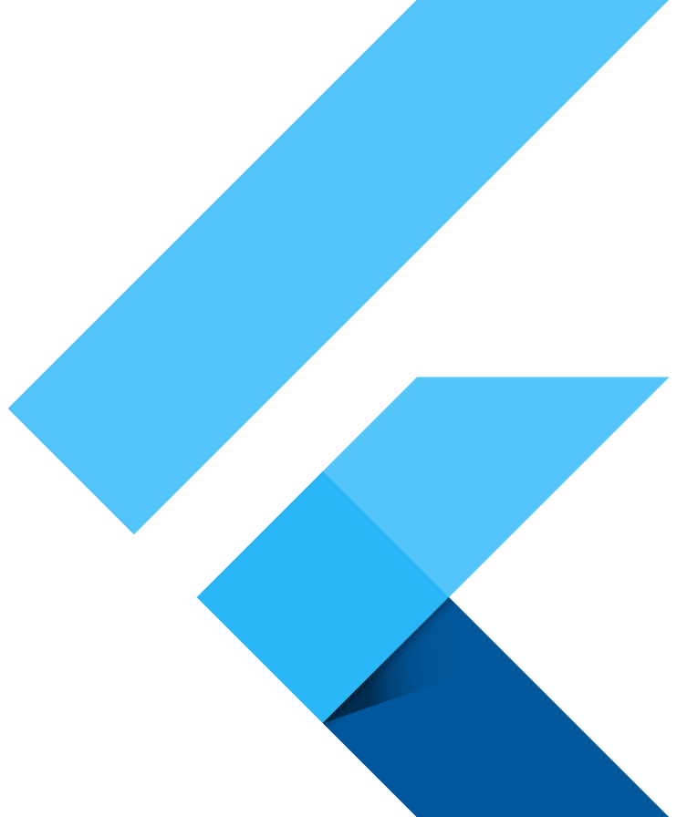
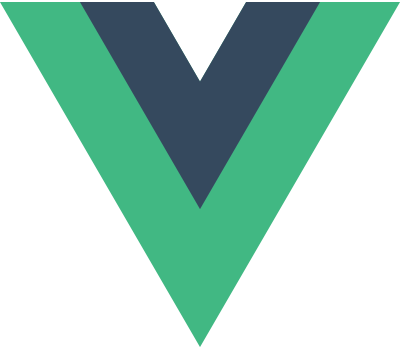
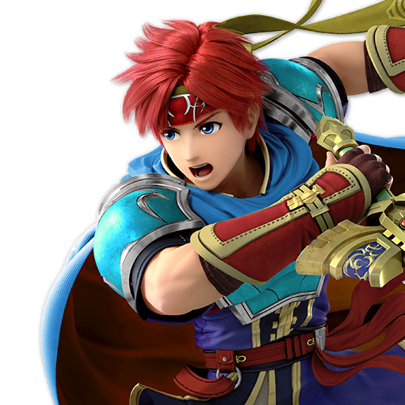

<link href="style.css" rel="stylesheet"></link>

## 触ったことあるやつ📚
 Flutter

 Vue.js (Nuxt.js)

 Electron
(Node.js)

## 触れる言語
- HTML
- CSS
- SCSS
- JavaScript
- TypeScript
- Dart

 

## 趣味⛳️
- スマブラ

<!--
**Zudah228/Zudah228** is a ✨ _special_ ✨ repository because its `README.md` (this file) appears on your GitHub profile.

Here are some ideas to get you started:

- 🔭 I’m currently working on ...
- 🌱 I’m currently learning ...
- 👯 I’m looking to collaborate on ...
- 🤔 I’m looking for help with ...
- 💬 Ask me about ...
- 📫 How to reach me: ...
- 😄 Pronouns: ...
- ⚡ Fun fact: ...
-->
